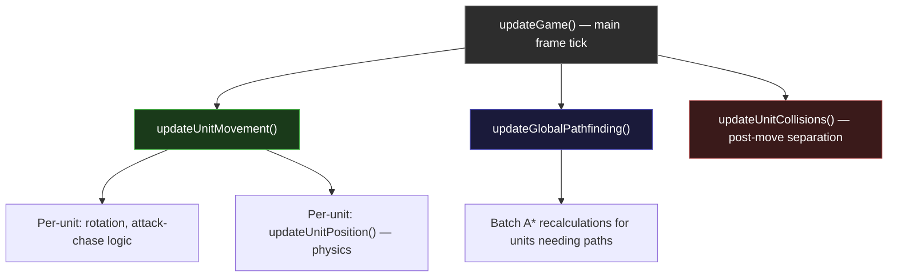
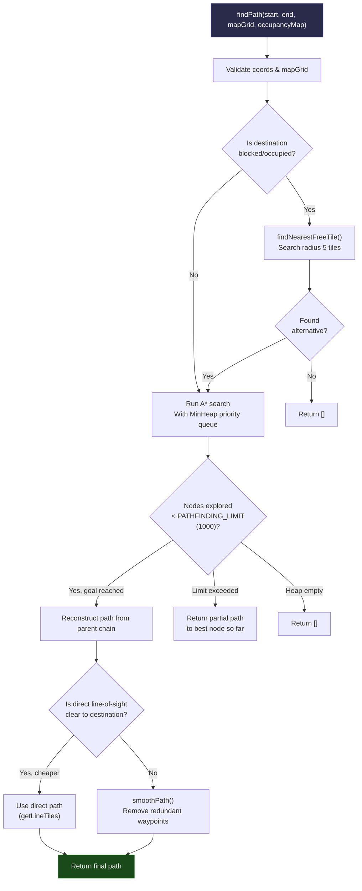
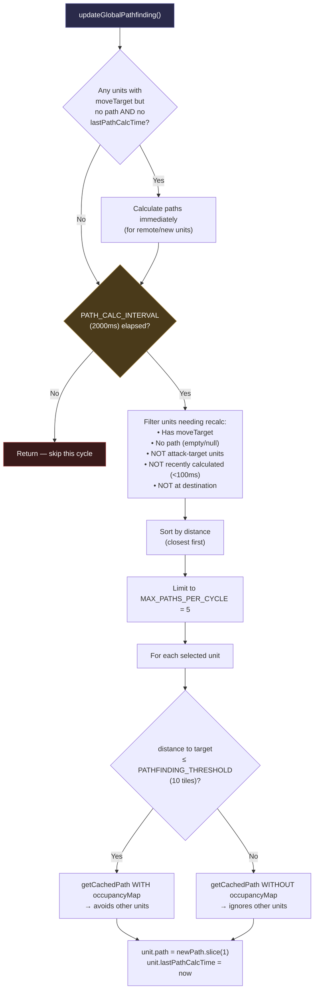
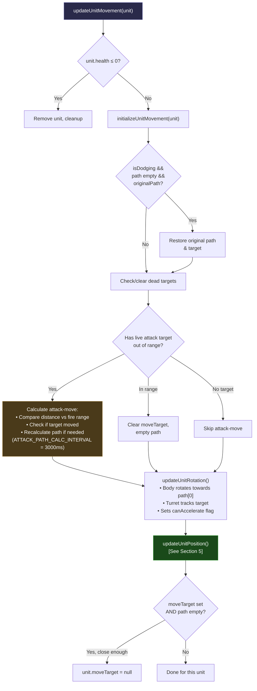
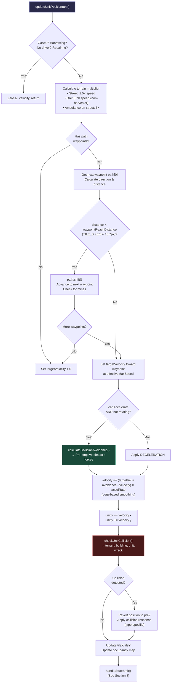
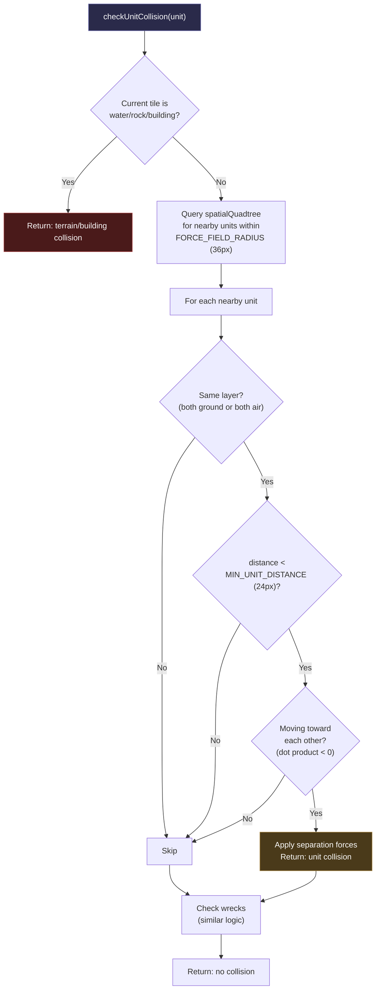
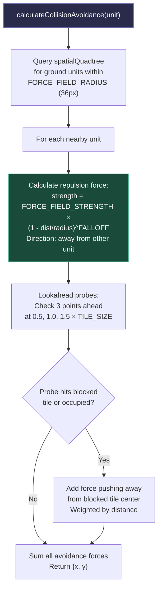
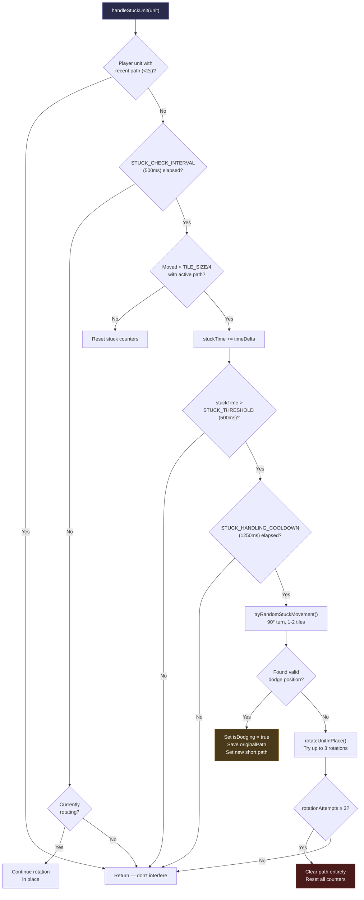
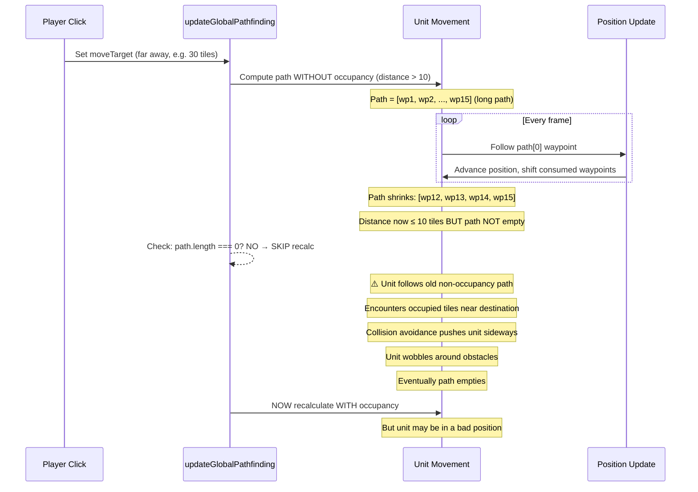

# Deep Analysis: Pathfinding, Unit Movement, Dodging & Collision Physics

> **Date**: 2025-02-10  
> **Purpose**: Root-cause analysis of why units often fail to reach targets directly, including full system documentation with flow diagrams.

---

## Table of Contents

1. [Architecture Overview](#1-architecture-overview)
2. [A* Pathfinding (`findPath`)](#2-a-pathfinding-findpath)
3. [Global Pathfinding Scheduler (`updateGlobalPathfinding`)](#3-global-pathfinding-scheduler-updateglobalpathfinding)
4. [Unit Movement Pipeline (`updateUnitMovement`)](#4-unit-movement-pipeline-updatunitmovementunitmovementjs)
5. [Position Update & Physics (`updateUnitPosition`)](#5-position-update--physics-updateunitposition)
6. [Collision Detection & Response](#6-collision-detection--response)
7. [Collision Avoidance (Pre-emptive)](#7-collision-avoidance-pre-emptive)
8. [Stuck Detection & Dodging](#8-stuck-detection--dodging)
9. [Steering Behaviours (Boids)](#9-steering-behaviours-boids)
10. [Flow Fields](#10-flow-fields)
11. [Key Configuration Constants](#11-key-configuration-constants)
12. [**ROOT CAUSE: Why Units Don't Reach Targets Directly**](#12-root-cause-why-units-dont-reach-targets-directly)
13. [**Fix Applied**](#13-fix-applied)

---

## 1. Architecture Overview

The movement system is split across multiple files with distinct responsibilities:

| File | Role |
|---|---|
| `src/units.js` | A* pathfinding algorithm, occupancy map, path smoothing |
| `src/game/pathfinding.js` | Global pathfinding scheduler with caching & throttling |
| `src/game/unitMovement.js` | Per-unit movement orchestration (attack chase, rotation, position update dispatch) |
| `src/game/movementCore.js` (`unifiedMovement.js`) | Physics-based position updates, velocity/acceleration |
| `src/game/movementCollision.js` | Collision detection against terrain/units/wrecks/buildings, collision response |
| `src/game/movementStuck.js` | Stuck detection, dodge manoeuvres, rotation recovery |
| `src/game/movementConstants.js` | Shared physics constants |
| `src/game/movementHelpers.js` | Utility functions (angle math, gas, air/ground checks) |
| `src/game/steeringBehaviors.js` | Boids-style separation/alignment/cohesion |
| `src/game/flowField.js` | On-demand flow fields for chokepoints |
| `src/game/spatialQuadtree.js` | Spatial indexing for efficient neighbour queries |

### Game Loop Call Order (per frame)

**Critical ordering**: `updateUnitMovement()` runs **before** `updateGlobalPathfinding()`. This means units consume path steps first, then the global scheduler checks if new paths are needed.

---

## 2. A* Pathfinding (`findPath`)

Located in `src/units.js:276`.

### Algorithm Summary

### Key Behaviours

- **Occupancy-aware**: When `occupancyMap` is passed, tiles with other units are treated as blocked (except the start tile).
- **Diagonal movement**: Uses 8-directional neighbours with diagonal corner-cutting checks.
- **Street cost bonus**: Street tiles have reduced path cost (`STREET_PATH_COST`), making roads preferred.
- **Partial paths**: When the search exceeds `PATHFINDING_LIMIT = 1000` nodes, returns the best partial path found so far. This is a **significant** cause of not-reaching-target behaviour.
- **Path smoothing**: After A*, `smoothPath()` tries to skip intermediate waypoints if there's a clear line-of-sight between non-adjacent nodes.

---

## 3. Global Pathfinding Scheduler (`updateGlobalPathfinding`)

Located in `src/game/pathfinding.js`.

### Scheduling Logic

### Path Cache (`getCachedPath`)

- Caches paths by destination key: `"{x},{y}-{hasOccupancy}-{owner}-{minePolicy}"`
- TTL: `PATH_CACHE_TTL = 4000ms`
- Reuses cached paths: if another unit's cached path passes through the querying unit's current tile, it slices from that point.

### **Critical Observation — The Dual Pathfinding Threshold Problem**

When a unit is **far away** (> 10 tiles), the path is computed **without** the occupancy map. This creates a "rough" path that doesn't account for other units. When the unit gets closer (≤ 10 tiles), it switches to occupancy-aware pathfinding.

**However**: the scheduler only recalculates when `unit.path` is **empty** (`path.length === 0`). The unit must first **consume the entire old path** before getting a new one. If the old long-distance path ends up blocked by units close to the destination, the unit has already committed to intermediate waypoints.

---

## 4. Unit Movement Pipeline (`updateUnitMovement` — unitMovement.js)

Called once per frame per unit. This is the main orchestration function.

### Rotation-Before-Movement Pattern

Before moving, the unit body must rotate to face the next waypoint. While rotating, `canAccelerate = false`, so the unit decelerates. Only when facing the correct direction does movement resume. This causes **pausing at every path bend**.

---

## 5. Position Update & Physics (`updateUnitPosition`)

Located in `src/game/movementCore.js` (exported from `unifiedMovement.js`).

### Key Physics Parameters

| Parameter | Value | Effect |
|---|---|---|
| `ACCELERATION` | 0.15 | Lerp rate toward target velocity |
| `DECELERATION` | 0.20 | Lerp rate toward zero when braking |
| `MAX_SPEED` | 0.9 px/frame | Base movement speed |
| `MIN_SPEED` | 0.05 px/frame | Below this → considered stopped |
| `ROTATION_SPEED` | 0.12 rad/frame | Body rotation rate |
| `MIN_UNIT_DISTANCE` | 24 px | Minimum separation between units |
| `FORCE_FIELD_RADIUS` | 36 px | Avoidance force detection range |
| `FORCE_FIELD_STRENGTH` | 2.5 | Avoidance push magnitude |

---

## 6. Collision Detection & Response

Located in `src/game/movementCollision.js`.

### Detection Flow

### Response Types

| Collision Type | Response |
|---|---|
| **Terrain/Bounds** | Revert position, apply bounce impulse, try slide movement |
| **Building** | Revert position, tanker trucks may detonate, otherwise slide |
| **Unit** | Revert position, push both units apart (safe separation), velocity damping |
| **Wreck** | Push wreck away with impulse, unit gets recoil |

### Slide Movement (`trySlideMovement`)

When direct movement is blocked, the system tries:
1. Move only on X-axis (zero Y velocity)
2. Move only on Y-axis (zero X velocity)
3. If both fail, zero all velocity

---

## 7. Collision Avoidance (Pre-emptive)

Located in `src/game/movementCollision.js:calculateCollisionAvoidance`.

This runs **before** the position update, adding avoidance forces to steer away from obstacles.

### How Avoidance Causes Deviation

The avoidance forces push units laterally, which can:
1. Deflect units off their intended straight-line path between waypoints
2. Cause units to orbit around obstacles instead of finding a clean path through
3. When combined with the waypoint-reaching check (`TILE_SIZE/3 ≈ 10.7px`), the unit may "wobble" around a waypoint as avoidance forces repeatedly push it away then back

---

## 8. Stuck Detection & Dodging

Located in `src/game/movementStuck.js`.

### Dodge Recovery

When dodging completes (dodge path consumed), the system restores `originalPath`. However:
- The original path was computed from a **previous position**, not the new post-dodge position
- The unit may now be further from the path it's being restored to
- The path waypoints may now be behind the unit

---

## 9. Steering Behaviours (Boids)

Located in `src/game/steeringBehaviors.js`. These are defined but **not actively integrated** into the main movement loop in `updateUnitPosition()`. The `calculateSteeringForces()` function exists but is not called from the core movement pipeline. The collision avoidance in `movementCollision.js` handles the practical separation.

---

## 10. Flow Fields

Located in `src/game/flowField.js`. Generated on-demand for chokepoints. The `calculateFlowFieldSteering()` is part of the steering behaviours module, which as noted above is not actively called in the movement pipeline.

---

## 11. Key Configuration Constants

| Constant | Value | File | Impact |
|---|---|---|---|
| `PATH_CALC_INTERVAL` | 2000 ms | config.js | How often global pathfinding batch runs |
| `ATTACK_PATH_CALC_INTERVAL` | 3000 ms | config.js | How often attack-chase paths recalculate |
| `MAX_PATHS_PER_CYCLE` | 5 | config.js | Max paths calculated per global batch |
| `PATHFINDING_THRESHOLD` | 10 tiles | config.js | Distance threshold for occupancy-aware pathfinding |
| `PATHFINDING_LIMIT` | 1000 nodes | config.js | A* search node budget before returning partial path |
| `MOVE_TARGET_REACHED_THRESHOLD` | 1.5 tiles | config.js | Distance to consider target "reached" |
| `PATH_CACHE_TTL` | 4000 ms | config.js | Path cache expiry |
| `STUCK_CHECK_INTERVAL` | 500 ms | config.js | How often stuck detection checks |
| `STUCK_THRESHOLD` | 500 ms | config.js | Time before considering unit stuck |
| `STUCK_HANDLING_COOLDOWN` | 1250 ms | config.js | Cooldown between stuck recovery attempts |
| `TILE_SIZE` | 32 px | config.js | Base tile size |

---

## 12. ROOT CAUSE: Why Units Don't Reach Targets Directly

### Issue Summary

Units frequently take indirect routes, pausing, wobbling, or stalling before eventually reaching their targets. There are **multiple contributing factors**:

### Factor 1: Path Draining Before Recalculation (THE MAIN BUG)

**The core problem**: `updateGlobalPathfinding` only recalculates when `path.length === 0`. A unit with a stale long-distance path (computed without occupancy awareness) continues to follow it even after entering the "close range" zone (< 10 tiles). The old waypoints don't account for other units, buildings, or dynamic obstacles near the destination.

### Factor 2: Partial Paths from A* Budget Limit

When `PATHFINDING_LIMIT = 1000` is exceeded, A* returns the path to the best node found so far — which may be **nowhere near the destination**. The unit follows this partial path to its end, then waits for the next recalculation cycle (up to 2000ms later) to get a new partial or full path.

### Factor 3: Avoidance Force Deflection

The pre-emptive `calculateCollisionAvoidance()` adds lateral forces that push units away from nearby units and obstacles. These forces are applied every frame and can:
- Push a unit off its waypoint approach vector
- Create oscillation as the unit is simultaneously attracted to the waypoint and repelled by nearby units
- Cause the unit to take a wider arc than necessary

### Factor 4: Rotation-Before-Movement Gating

Units must rotate to face each waypoint before accelerating. On a path with many short segments (common in non-smoothed paths), the unit spends significant time rotating → accelerating → decelerating → rotating for the next segment.

### Factor 5: Dodge/Stuck Recovery Path Staleness

When stuck detection triggers a dodge, the unit saves its current path as `originalPath`. After dodging, it restores this saved path — but the saved waypoints may now be behind the unit or in the wrong direction relative to the post-dodge position.

### Factor 6: Attack-Chase Path Oscillation

For units chasing a target, `ATTACK_PATH_CALC_INTERVAL = 3000ms` means the path to a moving target can be 3 seconds stale. Combined with the distance-increasing check, this can lead to the unit running past the target, realizing distance is increasing, then getting a new path in the opposite direction.

---

## 13. Fix Applied

### Fix: Proactive Path Recalculation When Entering Close Range

The primary fix targets **Factor 1** — the main bug where units continue following stale long-distance paths after entering the occupancy-aware zone. Instead of only recalculating when the path is empty, we now also recalculate when:

1. The unit is within `PATHFINDING_THRESHOLD` (10 tiles) of its destination
2. The current path was computed **without** occupancy awareness (long-distance mode)
3. There are still significant waypoints remaining

This ensures that when a unit transitions from "far away" to "close range", it immediately gets a fresh occupancy-aware path that properly accounts for dynamic obstacles near the destination.

Additionally, we trim stale waypoints from restored dodge paths — when a path is restored after dodging, we drop any waypoints that are behind the unit's current position, preventing the unit from backtracking.

### Changes Made

**`src/game/pathfinding.js`**: Added logic to detect when a unit's existing path was computed without occupancy awareness but the unit is now within the close-range threshold. Such units are included in the recalculation batch even if their path is not yet empty. A `pathComputedWithOccupancy` flag is tracked on each unit.

**`src/game/unitMovement.js`**: After restoring a saved path from a dodge, prune waypoints that are behind the unit's current position to avoid backtracking.
