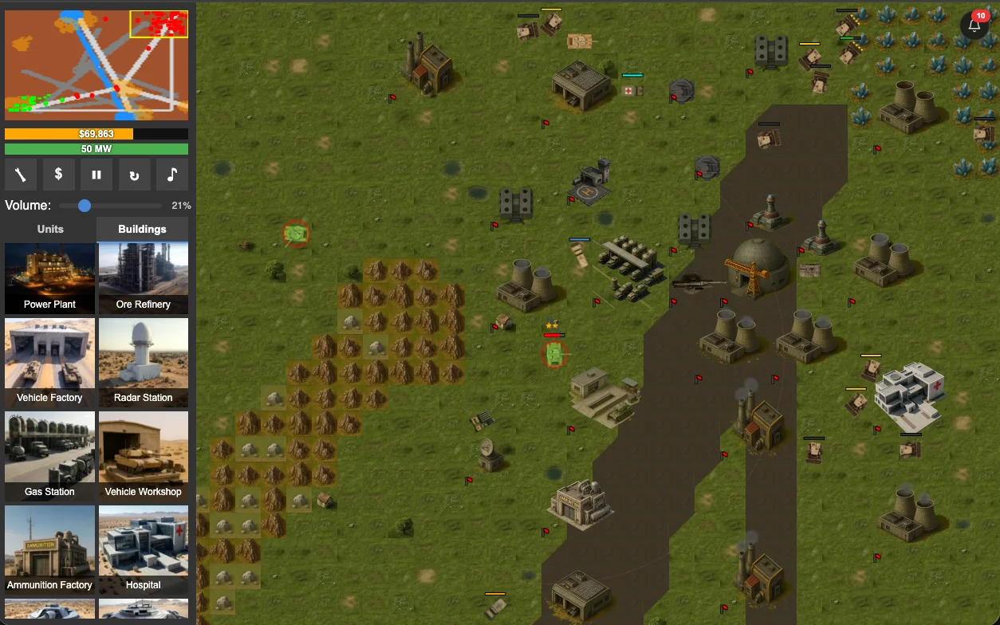
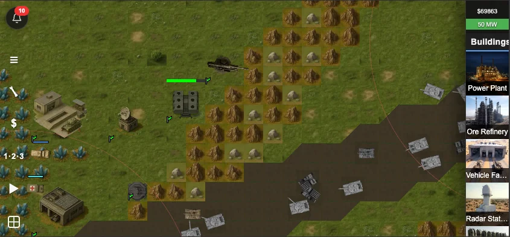
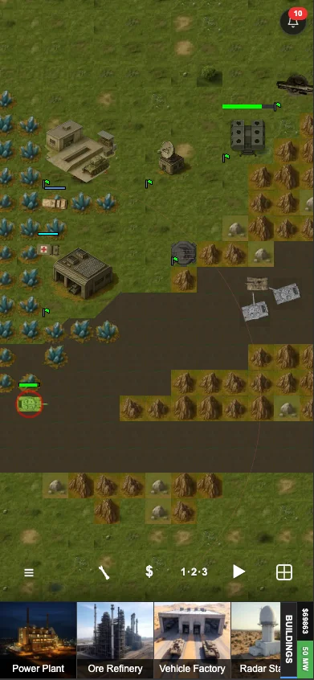

# Code for Battle

Code for Battle is a 2D, tile-based RTS game built with vanilla JavaScript and Canvas with WebGL (WebGPU also coming soon!).

## 🎯 Purpose

This project started in December 2024 as an experiment and benchmark: can frontier LLMs 0-shot a complex RTS game from prompt-driven development.

Over time, that benchmark evolved into a full RTS game. The long-term vision is to support LLM-controlled AI players and provide a built-in, user-friendly programming workflow so players can automate unit behavior and strategy (TBD).

The project is fully vibe coded.

## 🖼️ Screenshots

<p align="center">
	
</p>

<table>
	<tr>
		<td width="60%" valign="top">
			<strong>Mobile (Landscape)</strong><br />
			
		</td>
		<td width="40%" valign="top">
			<strong>Mobile (Portrait)</strong><br />
			
		</td>
	</tr>
</table>

## 🚀 Install and Run Locally

### ✅ Prerequisites

- Node.js 20+
- npm 10+

### 📦 Setup

```bash
npm install
```

### 🕹️ Start the game (local development)

```bash
npm run dev
```

The app will be available at the local URL shown by Vite in your terminal.

### 🌐 Optional multiplayer signalling helper

For invite-based WebRTC multiplayer testing, run the signalling helper in a second terminal:

```bash
npm run stun
```

### 🧪 Optional Netlify local multiplayer test

If Netlify CLI is installed globally, you can run a local Netlify environment for multiplayer/signalling endpoints:

```bash
netlify dev
```

## 📘 How to Play

User documentation and gameplay reference:

- [In-game and gameplay documentation](./Documentation.md)
- [Spec 032: In-Game User Documentation](./specs/032-user-documentation.md)

## 🏗️ Architecture Documentation

Technical and architecture-focused documentation:

- [Architecture diagram and technical notes](./AI_Docs/ARCHITECTURE_DIAGRAM.md)
- [Multiplayer architecture spec](./specs/001-add-online-multiplayer/)
- [State sync architecture notes](./specs/state-sync-module.md)

## 🗂️ Legacy README

The previous README has been preserved at:

- [README.legacy.md](./README.legacy.md)

## 📄 License

This project is licensed under the MIT License. See [LICENSE](./LICENSE).
